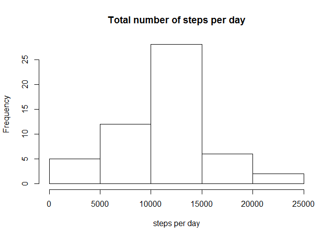
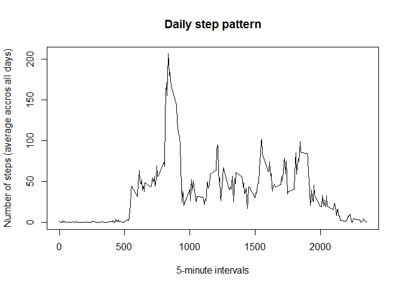
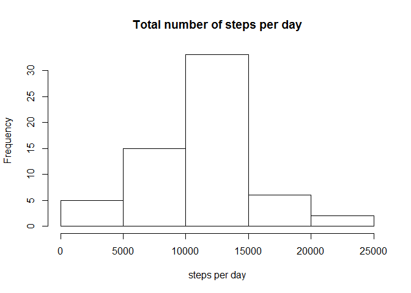
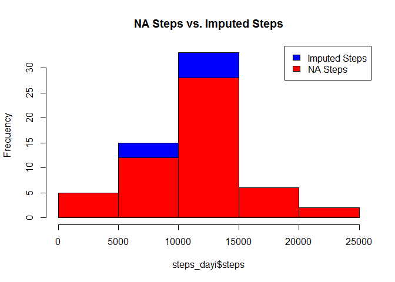
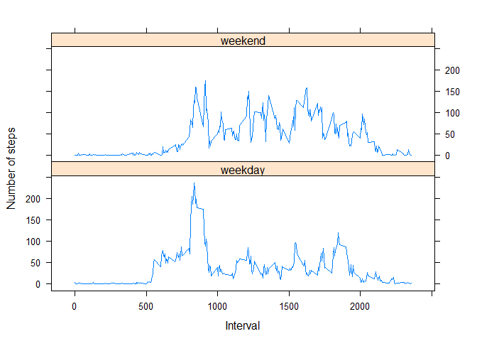

# Reproducible Research: Peer Assessment 1

## Loading and preprocessing the data

Unzip zipfile in cloned repo.

```r
if (!file.exists("activity.csv")) {
    ziparch <- "/activity.zip" 
    unzip(ziparch, exdir = "RepData_PeerAssessment1")
}
```

Read in data.

```r
dataraw <- read.csv("activity.csv", header=T, sep=',' , stringsAsFactors=F)
```

A brief analysis of the data.

```r
head(dataraw)
tail(dataraw)
dim(dataraw)
```

```r
str(dataraw)
```

```
## 'data.frame':	17568 obs. of  3 variables:
##  $ steps   : int  NA NA NA NA NA NA NA NA NA NA ...
##  $ date    : chr  "2012-10-01" "2012-10-01" "2012-10-01" "2012-10-01" ...
##  $ interval: int  0 5 10 15 20 25 30 35 40 45 ...
```

```r
names(dataraw)
```

```
## [1] "steps"    "date"     "interval"
```

Check for NAs.

```r
logic_na <- is.na(dataraw)
data_na <- dataraw[logic_na == TRUE, ]
nrow(data_na)
```

```
## [1] 2304
```

```r
100/nrow(dataraw)*nrow(data_na)
```

```
## [1] 13.11475
```

###Prossessing data: transform date into date format

```r
data1 <- dataraw
data1$date <- as.Date(data1$date, format = "%Y-%m-%d")
```

## What is mean total number of steps taken per day?


Calculate total number of steps per day.

```r
steps_day <- aggregate(steps ~ date, data1, sum)
```

Create histogram for steps per day.

```r
hist(steps_day$steps,main="Total number of steps per day",xlab="steps per day")
```

<!-- -->

Calculate and report the mean and median of the total number of steps taken per day.

```r
#Calculate mean and median of total steps per day
mean_steps <- as.integer(mean(steps_day$steps))
median_steps <- as.integer(median(steps_day$steps))
```
The mean of total number of steps per day is 10766.
The median of total number of steps per day is 10765.

## What is the average daily activity pattern?


```r
#Calculate and plot the average daily activity pattern
steps_pattern <- aggregate(steps ~ interval, data1, mean)
plot(steps_pattern$interval,steps_pattern$steps, type='l',xlab="5-minute intervals", main="Daily step pattern", ylab="Number of steps (average accros all days)")
```

<!-- -->

Which 5-minute interval, on average across all the days in the dataset, contains the maximum number of steps?


```r
#Calculate intervall with maximum number of steps 
steps_max <- max(steps_pattern$steps)
int_max <- steps_pattern[which.max(steps_pattern$steps), "interval"]
```
The intervall with maximum number of steps is 835, maximum steps beeing 206.

## Imputing missing values

Calculate and report the total number of missing values in the dataset.

```r
nrow(dataraw[is.na(dataraw$steps),])
```

```
## [1] 2304
```

The total number of steps with value = NA is 2304.

Devise a strategy for filling in all of the missing values in the dataset.

My strategy aims at averaging the missing steps values from the values of the same interval of the other same weekdays. The underlyling hypothesis is that same weekdays have a similar activity pattern and can be used for imputing missing values.


```r
#Create data frame for imputing NAs and containing the weekdays
library(plyr)
```

```
## Warning: package 'plyr' was built under R version 3.2.3
```

```r
datai <- data1

#Add weekdays variable and create combined variable of weekday.interval
dataiwd <- mutate(datai, wd = weekdays(data1$date, abbreviate = FALSE)) #Add weekdays
dataiwd$wd.int <- paste(dataiwd$wd, dataiwd$interval) #Create combined variable 

#Create data frame with average steps for weekday and interval
wdmean <- aggregate(steps ~ wd + interval, dataiwd, mean)
wdmean$wd.int <- paste(wdmean$wd, wdmean$interval)

#Impute NAs in data frame
for (i in 1:nrow(dataiwd)) {
    if (is.na(dataiwd$steps[i])) {
        dataiwd$steps[i] <- wdmean[which(dataiwd$wd.int[i] == wdmean$wd.int), ]$steps
    }
}
```

Create a new dataset that is equal to the original dataset but with the missing data filled in.

```r
library(dplyr)
```

```
## 
## Attaching package: 'dplyr'
```

```
## Die folgenden Objekte sind maskiert von 'package:plyr':
## 
##     arrange, count, desc, failwith, id, mutate, rename, summarise,
##     summarize
```

```
## Die folgenden Objekte sind maskiert von 'package:stats':
## 
##     filter, lag
```

```
## Die folgenden Objekte sind maskiert von 'package:base':
## 
##     intersect, setdiff, setequal, union
```

```r
datacomp <- select(dataiwd, -wd, -wd.int)
head(datacomp)
```

```
##      steps       date interval
## 1 1.428571 2012-10-01        0
## 2 0.000000 2012-10-01        5
## 3 0.000000 2012-10-01       10
## 4 0.000000 2012-10-01       15
## 5 0.000000 2012-10-01       20
## 6 5.000000 2012-10-01       25
```

Check for NA (should be 0).

```r
logic_nai <- is.na(dataiwd)
data_nai <- dataiwd[logic_nai == TRUE, ]
nrow(data_nai)
```

```
## [1] 0
```

Make a histogram of the total number of steps taken each day and calculate and report the mean and median total number of steps taken per day. Do these values differ from the estimates from the first part of the assignment?


```r
#Calculate total number of steps per day using the data frame "dataiwd"
steps_dayi <- aggregate(steps~date, dataiwd, sum)

#Create histogram for steps per day
hist(steps_dayi$steps,main="Total number of steps per day",xlab="steps per day")
```

<!-- -->


```r
#Calculate mean and median of total steps per day
mean_stepsi <- as.integer(mean(steps_dayi$steps))
median_stepsi <- as.integer(median(steps_dayi$steps))
```
The mean of total number of steps per day from the imputed data is 10821.
The median of total number of steps per day from the imputed data is 11015.

Comparing means and medians of data with missing values and imputed data.

```r
diffmean <- mean_stepsi - mean_steps
diffmedian <- median_stepsi - median_steps
```

mean old data is 10766  
mean imputed data is 10821  
difference: 55

median old data is 10765  
median imputed data is 11015  
difference: 250

The new mean and median of the imputed data are slightly higher than the old ones, 55 and 250 respectively.

###What is the impact of imputing missing data on the estimates of the total daily number of steps?

```r
library(dplyr)
steps_dayi$steps <- as.integer(steps_dayi$steps)
nrow(steps_day)
```

```
## [1] 53
```

```r
nrow(steps_dayi)
```

```
## [1] 61
```

```r
diffsteps_day <- nrow(steps_dayi) - nrow(steps_day)

hist(steps_dayi$steps, main = "NA Steps vs. Imputed Steps", col = "blue")
hist(steps_day$steps, col = "red", add=TRUE)

legend("topright", c("Imputed Steps", "NA Steps"), fill=c("blue", "red") )
```

<!-- -->

The imputed data set contains more rows (8). This means that there are days with no measurments, i.e. only NA steps. The histogram shows that the difference comes from rather step-intensive days, values of steps per day between 5'000 and 15'000. The overall pattern, however, has not changed.    

## Are there differences in activity patterns between weekdays and weekends?

```r
#Create a new factor variable in the dataset with two levels - "weekday" and "weekend" 
wdlevels <- unique(dataiwd$wd)
dataiwd$wd <- factor(dataiwd$wd, labels = wdlevels)

levels(dataiwd$wd)
```

```
## [1] "Montag"     "Dienstag"   "Mittwoch"   "Donnerstag" "Freitag"   
## [6] "Samstag"    "Sonntag"
```

```r
#Levels are taken from my PC parameters which are German. Just in case, here is the translation: Montag = Monday, Dienstag = Tuesday, Mittwoch = Wednesday, Donnerstag = Thursday, Freitag = Friday, Samstag = Saturday, Sonntag = Sunday.
    
levelswd <- levels(dataiwd$wd)[1:5]
levelswe <- levels(dataiwd$wd)[6:7]

levels(dataiwd$wd) <- list(weekday = levelswd, weekend = levelswe)
table(dataiwd$wd)
```

```
## 
## weekday weekend 
##   12960    4608
```

Panel plot containing plots of average number of steps taken on weekdays and weekends.


```r
#Calculate mean values for steps on weekdays and weekends
mean_steps5i <- aggregate(steps ~ interval + wd, data=dataiwd, mean)

#Create plot
library(lattice)
xyplot(mean_steps5i$steps ~ mean_steps5i$interval | mean_steps5i$wd, 
       layout = c(1, 2), type = "l", 
       xlab = "Interval", ylab = "Number of steps")
```

<!-- -->

Weekend and weekdays have clearly distinct patterns, as expected. Whereas weekdays have a marked morning and a less visible evening peak and less activity in between, the weekdend trend is, following a morning peak/slump pattern and interrupted by a marked midday break, first increasing and then decreasing. So, roughly, the weekdays pattern is U shaped and the weekend has this shape inversed. The plot suggests also, that people tend to sleep late on weekends ...
